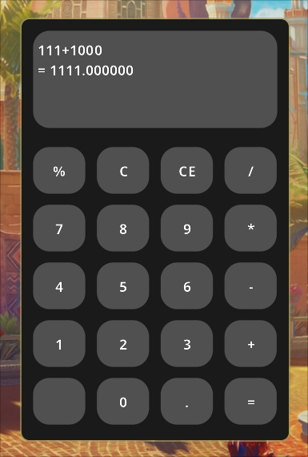

# SCalc حاسبة بسيطة

## لمحة



واجهة المستخدم/المكتبة المستخدمة للواجهة هي libleif وهي مكتبة واجهة مستخدم للوضع الفوري تشبه stb. (~ 3500 سطر من التعليمات البرمجية). تستخدم المكتبة برنامج OpenGL كواجهة خلفية للرسومات ويستخدم glfw لمعالجة النوافذ.

## التثبيت

### متطلبات البناء
- make
- glfw
- cglm
- libclipboard
- Noto fonts

#### ثم يمكنك تشغيل امر البناء 

```shell
sudo make && sudo make install
```

#### او يمكنك نسخ الملف الثنائي الى `/usr/bin` فقط
## الغاء التثبيت

```shell
sudo make uninstall
```

## التشغيل 

يوجد ملف .desktop يتم تثبيته تلقائيًا عند التثبيت ويمكنك الوصول إليه أو تشغيله فقط عبر الطرفية :

```shell
scalc
```
